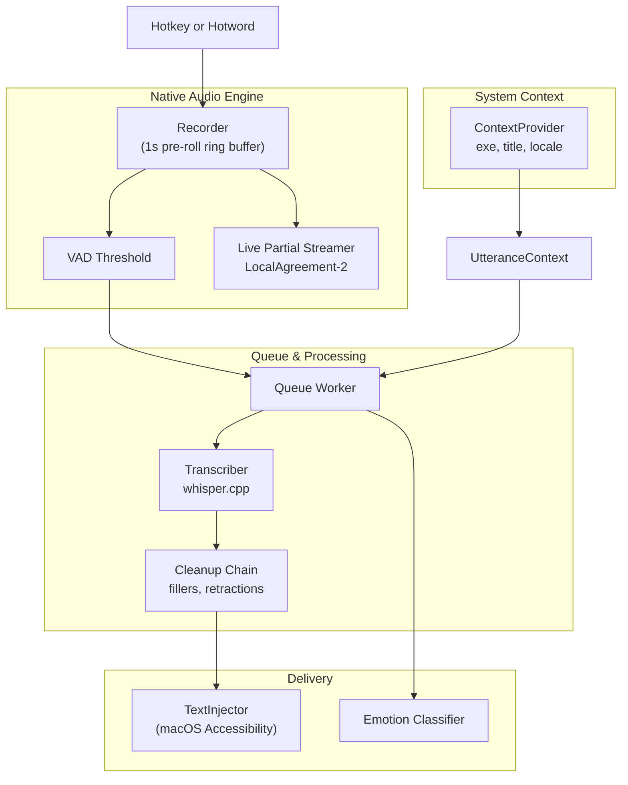

# Wisper Emotion

Wisper Emotion is a native macOS dictation application and acoustic emotion classifier. 

It provides sub-200ms, entirely offline voice dictation by running `whisper.cpp` locally. Built as a lightweight Electron application with a native C++ audio pipeline, it captures speech into a pre-roll ring buffer, analyzes vocal tone in real-time, and securely injects the cleaned transcript directly into your active window (VS Code, Slack, Terminal, etc.).

No audio or transcription data ever leaves your machine.

---

## Architecture Overview

Wisper Emotion uses a **Svara-style** pipeline architecture designed for zero-latency capture and deterministic cleanup.



### 1. Pre-Roll Capture
The microphone runs continuously, keeping the last 1000ms of audio in a circular **Ring Buffer**. When the trigger hotkey is pressed, this pre-roll is immediately copied, ensuring the first syllables of speech are never cut off.

### 2. Fast Local Inference
Audio is captured at 16kHz mono and processed through `whisper.cpp` as raw PCM arrays entirely in memory. The system never writes audio files to disk, eliminating disk I/O latency and security risks.

### 3. Cleanup Pipeline
Raw transcripts pass through a determinisitic Chain of processors:
- **Fillers**: Strips "um", "uh", "like".
- **Retractions**: Handles spoken corrections (e.g., "start server no wait stop server" -> "stop server").
- **App-Specific Rules**: Formats differently if dictating into `Terminal.app` vs `Slack.app`.

---

## Setup & Installation

### Option 1: Direct Download (Recommended)
Download the latest pre-compiled macOS DMG from the [Releases](https://github.com/sainideep1234/my-wisper-emotion/releases/latest) page.

**Gatekeeper Notice**: Because this is a custom indie build, macOS will quarantine the app and display an "App is damaged" error. To bypass this:
1. Drag **Wisper Emotion** into your `Applications` folder.
2. Open `Terminal` and run: `xattr -cr "/Applications/Wisper Emotion.app"`
3. Launch the application.

### Option 2: Build from Source
Ensure you have `portaudio` and `cmake` installed on your Mac.

```bash
# 1. Install system dependencies
brew install portaudio cmake

# 2. Setup project (installs bun deps, builds native Whisper & UI hooks)
bun run setup

# 3. Start development mode
bun run dev

# 4. Build DMG
bun run build:app
```

---

## Usage

| Gesture | Action |
|---------|--------|
| Hold `fn` | Push-to-talk (injects on release) |
| `fn` + `Space` | Toggle hands-free recording lock |
| `⌘` + `⌥` + `Space` | Toggle (alternative hotkey) |
| `Shift` + `C` | Clipboard History / Re-paste last dictation |

### Required Permissions
On first launch, macOS will request several permissions:
- **Microphone**: For audio capture.
- **Accessibility**: To capture the `fn` key globally.
- **Automation / System Events**: To simulate keypresses and paste text into your active app.

---

## Folder Structure

The repository is structured as a monorepo leveraging `bun`:

- `packages/desktop/` - Electron main process, tray UI, and frontend overlay (Vite/React).
- `packages/engine/` - Core Node.js audio pipeline, RingBuffer, VAD, and cleanup chain.
- `whisper.cpp/` - Git submodule of the `whisper.cpp` native engine with Node API wrappers.
- `website/` - Next.js landing page.
- `models/` - Local storage directory for downloaded `.bin` model weights.

## Contributing

Pull requests are welcome. Please ensure your code adheres to the existing architecture. 
For major architectural changes, please submit an issue first to discuss trade-offs. Read the `docs/` folder for Architecture Decision Records (ADRs) before refactoring core components.
